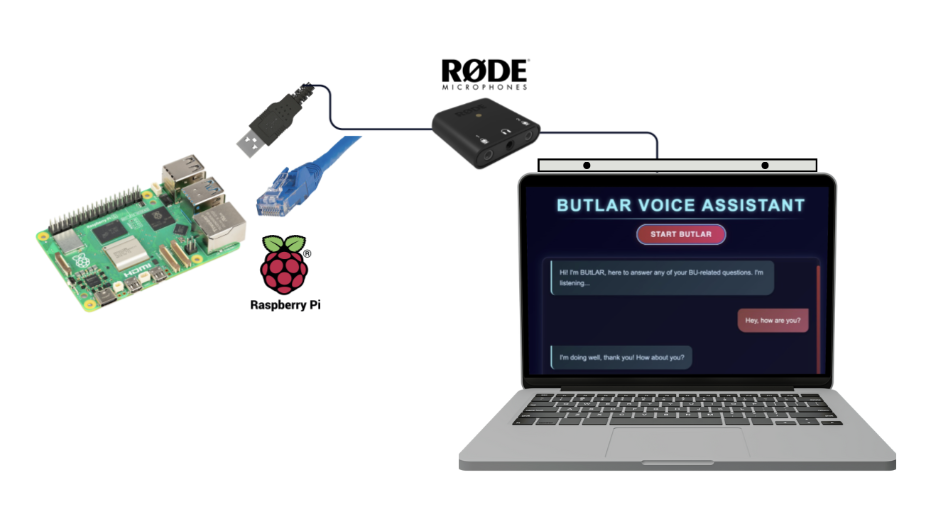
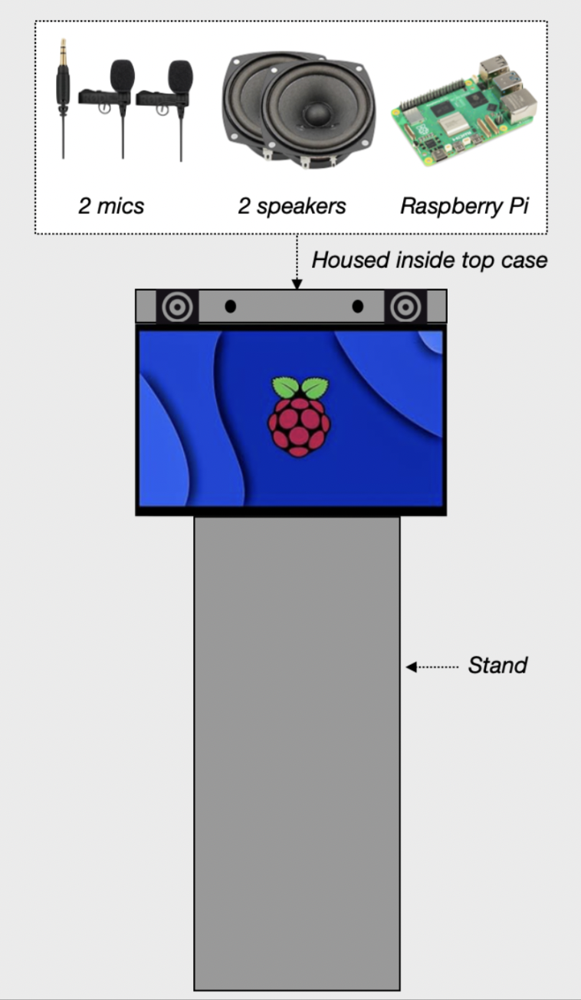

# BUtLAR Hardware Documentation

BUtLAR is simple to set up, requiring minimal hardware. 

## Hardware Components and Specifications

| Component     | Quantity| Specifications |
| ------------- |:--------:| -------------:|
| Raspberry Pi 5|   1      |     128 GB    |
| AI-Micro Rode Dual Speakers|  2   |     100dB A-Weighted   |
| Mic Housing   |   1      | 9 in x 2.6 in x 0.29 in|

## BUtLAR Hardware Block Diagram 
BUtLAR's hardware block diagram follows as everything connected to the Raspberry Pi including the Rode microphones which are housed on the laptop.

## Microphone Housing 3D Drawing 
The Rode microphones are housed in a simple setup where it can be placed on top of the laptop. This housing display was designed in SolidWorks and 3D printed using black PETG filament. 

[Mic Housing](images/Mic_Housing.pdf)

## Future Design

Future senior design groups can follow another design where rather than using a laptop to display BUtLAR, an LCD screen and speakers can replace the laptop (more cost effective). Then this will be placed on a stand that can be adjusted based on a person's height. This is an alternative design approach future groups can consider should they want to replace the laptop. 

