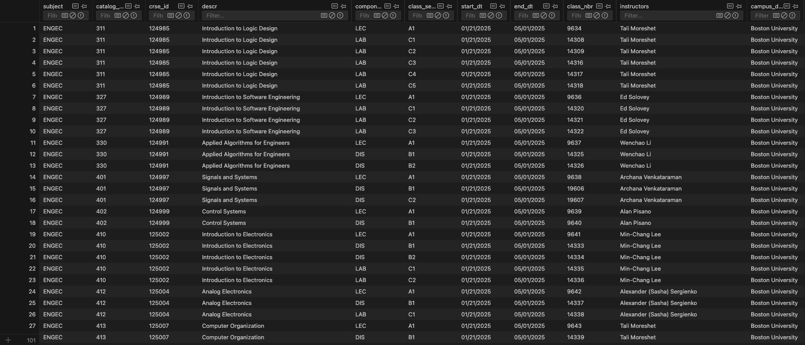
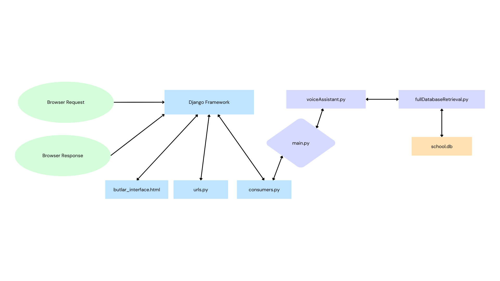
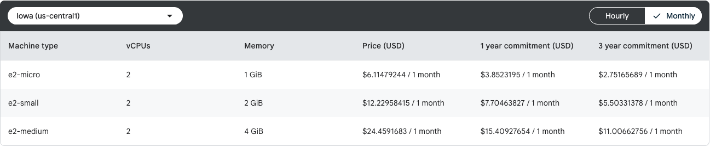

# Frontend

[](https://www.djangoproject.com/)
[](https://github.com/mackron/miniaudio)

*Our frontend implementation is extremely basic, it has just been implemented for voice activation and displaying the raw backend architecture.*

---

[urls.py](Audio/testing_audio/django_top/butlar/urls.py) (part of the Django framework) does the URL forwarding to preload the information to the user.

---

[consumers.py](Audio/testing_audio/django_top/butlar/consumers.py) manages real-time communication between the Django frontend and the voice assistant backend using WebSockets.
When a user connects, it spawns a new thread that launches the audio capture and processing pipeline through a shell command. This subprocess streams microphone input into a pipeline involving ```miniaudio_stream```, ```sox```, and ```main.py```. ```miniaudio_stream``` is an executable that was created using a simple ```C``` file. Here is the main loop of [miniaudio_stream.c](Audio/testing_audio/miniaudio_stream.c):
```c
    // Start device
    result = ma_device_start(&device);
    if (result != MA_SUCCESS) {
        fprintf(stderr, "Failed to start device\n");
        ma_device_uninit(&device);
        ma_context_uninit(&context);
        return -1;
    }

    // Run until signal received
    while (running) {
        ma_sleep(100);
        
    }

    // Cleanup
    ma_device_uninit(&device);
    ma_context_uninit(&context);
    return 0;
```

Inside the subprocess loop, the consumer reads lines of output and categorizes them into types: transcripts, responses, or status updates. These are sent back to the frontend through the WebSocket. For instance, when a final transcript is recognized:

```python
if text.startswith("Final transcript:"):
    payload = {"type": "transcript", "text": text.replace("Final transcript:", "").strip()}
```

The consumer also listens for control messages from the frontend, such as "pause" or "resume", and updates internal flags accordingly. This controls when the backend should stop listening (during TTS playback) or start listening again. This is done by writing into simple flag files:


```python
with open(flag_file, "w") as f:
    f.write("responding")
```

---

[butlar_interface.html](Audio/testing_audio/django_top/butlar/templates/butlar/butlar_interface.html) provides the web-based user interface for interacting with BUtLAR.
It establishes a WebSocket connection to the backend when the user clicks “Start,” and dynamically displays messages and system status updates in a chat-style window.

When a transcript or a final response is received from the backend, it updates the chat window and speaks the response using the browser’s SpeechSynthesis API:

```javascript
const utterance = new SpeechSynthesisUtterance(data.text);
speechSynthesis.speak(utterance);
```

During TTS playback, the frontend sends a "pause" message to the backend to prevent accidental audio capture, and a "resume" message when speaking finishes:

```javascript
socket.send(JSON.stringify({ type: "pause", duration: estimatedDurationSec }));
```

The UI also updates a visible status bar to reflect current activities — whether the system is listening, processing, or speaking — providing clear feedback to the user.


# Backend
[](https://platform.openai.com/)
[](https://cloud.google.com/)


[main.py](Audio/testing_audio/main.py) calls the ```process_audio_stream()``` function from voiceAssistant.py. It is called by the django backend.

---

[fullDatabaseRetrieval.py](Audio/testing_audio/fullDatabaseRetrieval.py) loads course information from a local JSON file and handles natural language questions by matching key attributes such as course code, meeting time, location, or instructor name. It corrects professor names using an OpenAI LLM call if there are typos or phonetic variations. The corrected question is then parsed and matched against the available course dataset. The system matches course codes (e.g., “EC 413”), section types, and instructor names to identify relevant information. It handles structured breakdowns for different types of questions, such as “when,” “where,” or “who teaches.” Finally, it formats a prompt that contains only valid course data, instructing the LLM to answer strictly based on the provided information.

```
You are an assistant answering BU course questions using ONLY this data: [course info]...
Q: [user question]
A:
```

Asking a question through the OpenAI API is the most important response for the prompt engineering section.

```python
def ask_question(question):
    with open(COURSE_DATA_FILE) as f:
        data = json.load(f)
    courses = data["New item - 2"]["classes"]

    course_info_string = "\n".join(summarize_course_for_question(question, courses))

    prompt = f"""
    You are an assistant answering BU course questions using ONLY this data:
    {shorten(course_info_string, width=12000, placeholder="...")}

    Q: {question}
    A:"""

    response = client.chat.completions.create(
        model="gpt-4o-mini",
        messages=[{"role": "user", "content": prompt}],
        temperature=0.2,
    )
    return response.choices[0].message.content
```

Professor names in questions are corrected by matching against a known instructor list, handled by a dedicated LLM prompt.

```python
def correct_last_name(question):
    completion = client.chat.completions.create(
        model="gpt-4o-mini",
        messages=[{"role": "system", "content": "You are a precise name-matching assistant."},
                  {"role": "user", "content": prompt}],
        temperature=0.1,
    )
    return corrected if corrected else question
```

---

[voiceAssistant.py](Audio/testing_audio/voiceAssistant.py) streams live audio input to Google Cloud Speech-to-Text using the StreamingRecognizeRequest API. Audio is captured at 16 kHz, two-channel, 16-bit samples. The script also uses ```StreamingRecognizeRequest ``` configuration. In this way, there is automatic punctuation and interim results.

Whenever the assistant is about to speak — for example, when it generates a TTS response based on a completed question — it writes a temporary flag indicating that it is “responding.” During this period, instead of reading real audio from the microphone, the generator deliberately produces silent audio chunks, made up of zero bytes. This allows the streaming connection to remain active because Google’s API expects continuous audio, but it prevents the assistant’s own voice from being captured. Here, the silence injection is handled simply by yielding:

```py 
yield StreamingRecognizeRequest(audio_content=silent_chunk)
```

Once the assistant finishes speaking, the system transitions back into listening mode. However, there is an important detail to avoid capturing any residual audio that may still exist in the microphone buffer. Before resuming normal capture, the code flushes a large number of audio chunks — effectively discarding several seconds’ worth of stale or leftover audio — ensuring that when the microphone is live again, it captures only fresh user speech and not echoes of the assistant itself. The flushing mechanism reads and discards audio from stdin in a loop:

```py
for _ in range(flush_chunks):
    _ = sys.stdin.buffer.read(4096)
```

The code will also stop processing as soon as ```goodbye``` is spoken, or if a timeout occurs. Here is the implementation of the former termination case:
```python
if "goodbye" in transcript_lower and ("butlar" in transcript_lower or "butler" in transcript_lower):
    with open(flag_file, "w") as f:
        f.write("responding")
    print("Response: I hope I answered your questions. Goodbye!")
```

# Database
[school.db](Audio/testing_audio/sql_database/school.db) is the database that loads our data. For ease, here are what the rows look like:


# Flowchart


### *Green indicates a user, blue indicates frontend, purple indicates backend, and orange is the database*

# Future Work (Using BUtLAR across other datasets)
[](https://vanna.ai/)

"[Vanna](https://github.com/vanna-ai/vanna)
 is an MIT-licensed open-source Python RAG (Retrieval-Augmented Generation) framework for SQL generation and related functionality" (Vanna-AI, 2024).

A Google Cloud-hosted VM was created for this project to host a Postgres database. It was made following this
[guide](https://medium.com/@harits.muhammad.only/how-to-deploy-free-postgresql-database-server-on-google-cloud-vm-instance-7dc0c8999a12). We use a ```e2-micro``` VM since it was the cheapest option.


VannaAI was adopted because of its usability across different platforms. You will need to assign a database, LLM, and metadata storage. Here are the options that you can choose from:

#### Database:
``` 
Postgres, Microsoft SQL Server, MySQL, DuckDB, Snowflake, BigQuery, SQLite, Oracle, or any other SQL-based database
```

#### LLM:
``` 
OpenAI, Azure OpenAI, Anthropic, Ollama, Gemini, Mistral, or other LLM models
```

#### Metadata storage:
```
ChromaDB, Qdrant, Marqo, or any other vector database (this requires much more setup)
```

Use the [initialize_database.ipynb](/Audio/testing_audio/initialize_database.ipynb) file to configure the appropriate API key and LLM.

Note that the following configurations are for OpenAI as the LLM, Postgres as the database, and ChromaDB as the vector field.

```python
vn = MyVanna(config={'api_key': api_key, 'model': 'gpt-3.5-turbo'})
vn.connect_to_postgres(host=, dbname=, user=, password=, port=)
```

Add documentation from Vanna or other information that is easily parsable by the database. *You can follow the VannaAI documentation for a more thorough explanation*

```python
# The information schema query may need some tweaking depending on your database. This is a good starting point.
df_information_schema = vn.run_sql("SELECT * FROM INFORMATION_SCHEMA.COLUMNS")

# This will break up the information schema into bite-sized chunks that can be referenced by the LLM
plan = vn.get_training_plan_generic(df_information_schema)
```

The next portion of code is for training your data against your database. You can modify it slightly with the following methods. In testing with the ECE day dataset and the BU college courses, ```vn.train()``` was used the most extensively.

```python
# DDL statements are powerful because they specify table names, column names, types, and potentially relationships
vn.train(ddl="""
    CREATE TABLE IF NOT EXISTS my-table (
        id INT PRIMARY KEY,
        name VARCHAR(100),
        age INT
    )
""")

# Sometimes you may want to add documentation about your business terminology or definitions.
vn.train(documentation="Our business defines OTIF score as the percentage of orders that are delivered on time and in full")

# You can also add SQL queries to your training data. This is useful if you have some queries already laying around. You can just copy and paste those from your editor to begin generating new SQL.
vn.train(sql="SELECT * FROM my-table WHERE name = 'John Doe'")
```

After initializing your code up to this point, you can run it alongside  [voiceAssistant_vanna.py](voiceAssistant_vanna.py) that uses code from [call_vanna.py](call_vanna.py). You will need to change the details about the database in voiceAssistant again.

```python
vn.connect_to_postgres(host=, dbname=, user, password=, port=)
```


# Customer Usage:
To utilize this software project and to achieve everything that we have accomplished, you will need to follow the steps below:

1. Create a virtual environment based on the [requirements.txt](requirements.txt) file. **You do not need any other downloads other than having Python 3.12 and the Python packages specified by the requirements.txt.**
2. Create a Google Cloud project and make sure your terminal session connects to your service account. You can find a more detailed explanation at this [link](https://cloud.google.com/resource-manager/docs/creating-managing-projects). You can follow these instructions in [google_cloud_instructions.txt](requirements.txt).

3. Create an API key for OpenAI and name it as ```open_ai_api_key``` in the [.env](.env) file.

4. Run the server via 

```daphne -b 127.0.0.1 -p 8000 django_top.asgi:application```

5. Enter the URL in the web browser of your choice:

```http://127.0.0.1:8000/butlar/interface/```

